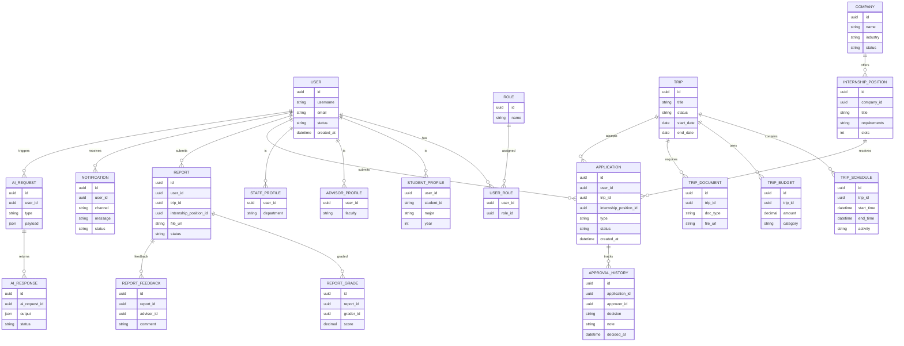

# ERD and REST API Contract (Draft)

This document provides a draft ERD and a minimal REST API contract for the
Trip/Internship Management platform.

## ERD (Mermaid)



## API Conventions

- Base path: `/api/v1`
- Auth: JWT (Authorization: Bearer <token>)
- Pagination: `page`, `size`, `sort`
- Standard error format:
  - `code` (string), `message` (string), `details` (array)

## Authentication

| Method | Endpoint           | Notes                         |
|--------|--------------------|------------------------------|
| POST   | /auth/login        | Returns access + refresh     |
| POST   | /auth/refresh      | Returns new access token     |
| POST   | /auth/logout       | Invalidates refresh token    |

## Trips

| Method | Endpoint                 | Description                  |
|--------|--------------------------|------------------------------|
| GET    | /trips                   | List trips                   |
| POST   | /trips                   | Create trip (Advisor)        |
| GET    | /trips/{id}              | Trip details                 |
| PUT    | /trips/{id}              | Update trip                  |
| POST   | /trips/{id}/publish      | Publish trip                 |
| GET    | /trips/{id}/schedule     | List schedule items          |
| POST   | /trips/{id}/schedule     | Add schedule item            |

Trip create payload (example):

```json
{
  "title": "Industry Visit 2026",
  "objective": "Observe manufacturing processes",
  "startDate": "2026-03-01",
  "endDate": "2026-03-02"
}
```

## Internship Positions

| Method | Endpoint                         | Description            |
|--------|----------------------------------|------------------------|
| GET    | /internships                     | List positions         |
| POST   | /internships                     | Create position        |
| GET    | /internships/{id}                | Position details       |
| PUT    | /internships/{id}                | Update position        |

## Applications and Approvals

| Method | Endpoint                         | Description             |
|--------|----------------------------------|-------------------------|
| POST   | /applications                    | Apply (trip/internship) |
| GET    | /applications                    | List my applications    |
| GET    | /applications/{id}               | Application detail      |
| PUT    | /applications/{id}/approve       | Approve or reject       |
| GET    | /applications/{id}/history       | Approval history        |

Approval payload:

```json
{
  "decision": "APPROVE",
  "note": "Meets requirements"
}
```

## Reports

| Method | Endpoint                      | Description              |
|--------|-------------------------------|--------------------------|
| POST   | /reports                      | Upload report            |
| GET    | /reports/{id}                 | Report details           |
| PUT    | /reports/{id}/grade           | Grade report             |

## Documents and Files

| Method | Endpoint                      | Description               |
|--------|-------------------------------|---------------------------|
| POST   | /files                        | Upload file (S3/MinIO)    |
| GET    | /files/{id}                   | Download file             |

## Notifications

| Method | Endpoint                      | Description               |
|--------|-------------------------------|---------------------------|
| GET    | /notifications                | List user notifications   |
| PUT    | /notifications/{id}/read      | Mark as read              |

## Analytics

| Method | Endpoint                      | Description               |
|--------|-------------------------------|---------------------------|
| GET    | /analytics/overview           | KPIs and summary          |
| GET    | /analytics/trips              | Trip stats                |
| GET    | /analytics/internships        | Internship stats          |

## AI Assistant

| Method | Endpoint                      | Description               |
|--------|-------------------------------|---------------------------|
| POST   | /ai/summary                   | Summarize report          |
| POST   | /ai/recommend                 | Recommend internships     |
| POST   | /ai/draft                     | Draft approval document   |
| POST   | /ai/chat                      | FAQ chatbot               |

AI request (example):

```json
{
  "type": "REPORT_SUMMARY",
  "input": {
    "reportId": "uuid",
    "language": "en"
  }
}
```
